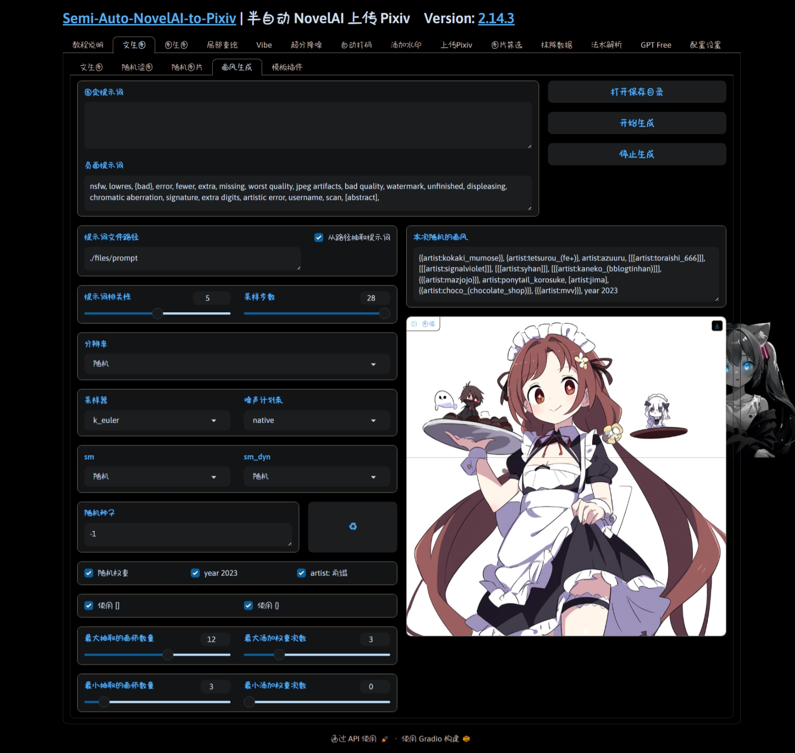

  </a>

<h1 align="center">sanp_plugin_random_artists</h1>
<h4 align="center">✨随机生成画风串✨</h4>

    
    
    
    
    

## 💬 介绍

通过随机抽取单画师提示词, 添加随机权重, 组合成画风串

## ✨ 功能

## 💿 安装

在[主体项目](https://github.com/zhulinyv/Semi-Auto-NovelAI-to-Pixiv) `plugin\t2i` 目录下直接克隆本项目

## 🤝 鸣谢

本项目使用 [300画风法典](https://docs.qq.com/sheet/DZWZMemxNZkpVR0VB) 提供的单画师提示词